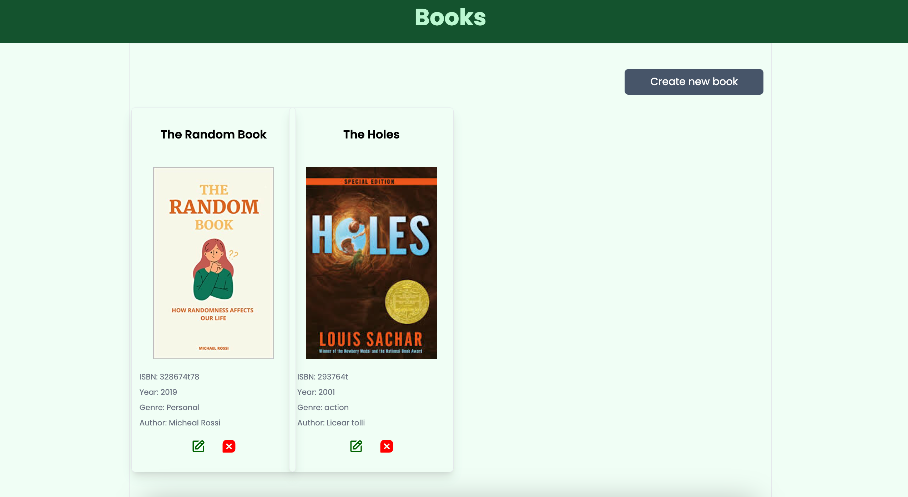

 

<a name="readme-top"></a>
 
 
<!-- PROJECT LOGO -->
<br />
<div align="center">
   
  <a href="https://github.com/ibrsec/book-fs-frontend-react">
    
  </a>

  <h3 align="center">Frontend of Book App</h3>

  <p align="center">
    An awesome Frontend of Book App 
    <!-- <a href="https://github.com/ibrsec/book-fs-frontend-react"><strong>Explore the docs »</strong></a> -->
    <br />
    <br /> 
    <a href="https://book-fs-frontend-react.vercel.app/">View Demo</a>
    · 
    <a href="https://github.com/ibrsec/book-fs-backend-express">Backend repo</a>
    ·
    <a href="https://github.com/ibrsec/book-fs-frontend-react/issues">Report Bug</a>
    ·
    <a href="https://github.com/ibrsec/book-fs-frontend-react/issues">Request Feature</a>
  </p>
</div>


<!-- TABLE OF CONTENTS -->
<details>
  <summary>📎 Table of Contents 📎 </summary>
  <ol>
    <li><a href="#about-the-project">About The Project</a></li>
     <!-- <li><a href="#figma">Figma</a></li> -->
     <li><a href="#overview">Overview</a></li>
     <li><a href="#quick-setup">Quick Setup</a></li>
     <li><a href="#directory-structure">Directory structure</a></li>
     <li><a href="#built-with">Built With</a></li>
    <!-- <li>
      <a href="#getting-started">Getting Started</a>
      <ul>
        <li><a href="#prerequisites">Prerequisites</a></li>
        <li><a href="#installation">Installation</a></li>
      </ul>
    </li>
    <li><a href="#usage">Usage</a></li>
    <li><a href="#roadmap">Roadmap</a></li>
    <li><a href="#contributing">Contributing</a></li>
    <li><a href="#license">License</a></li>
    <li><a href="#contact">Contact</a></li>
    <li><a href="#acknowledgments">Acknowledgments</a></li> -->

    
  </ol>
</details>


---

<!-- ABOUT THE PROJECT -->
<a name="about-the-project"></a>
## ℹ️ About The Project

[](https://book-fs-frontend-react.vercel.app/)
 
 


<p align="right">(<a href="#readme-top">back to top</a>)</p>


---

<!-- ## Figma 

<a href="https://www.figma.com/file/ePyCHKsx2ODB32uLgyUEEd/bootstrap-home-page?type=design&node-id=0%3A1&mode=design&t=edDzadCB9Ev5FS1a-1">Figma Link</a>  

  <p align="right">(<a href="#readme-top">back to top</a>)</p>


--- -->
<a name="overview"></a>
## 👀 Overview

📦 Frontend of the my Books App project | [Books Backend](https://github.com/ibrsec/backend-stockapi)  </br></br>


🎯 <b>React Development:</b> Built a responsive frontend with React.js, providing a seamless user experience for managing books, authors, and user profiles.</br>

🛠 <b>State Management:</b> Employed Redux Toolkit to manage state efficiently and maintain consistency across sessions.</br>

📡 <b>Data Fetching:</b> Used Axios for API requests, ensuring fast and reliable data retrieval and updates.</br>

🚀 <b>React Router:</b> Integrated React Router for smooth navigation between key sections like book listings, author details, and user management.</br>

🔔 <b>User Notifications:</b> Implemented React Toastify to provide real-time feedback for actions such as adding, editing, or deleting books and authors.</br>

💾 <b>CRUD Operations:</b> Developed full CRUD functionality for managing books, authors, genres, and user accounts effectively.</br>

🎨 <b>Styling:</b> Utilized Tailwind CSS to build a modern and responsive user interface quickly and efficiently.</br>


<p align="right">(<a href="#readme-top">back to top</a>)</p>


<a name="quick-setup"></a>
## 🛫 Quick Setup

```sh
# clone the project
git clone https://github.com/ibrsec/book-fs-frontend-react.git

# enter the project directory
cd book-fs-frontend-react

# install dependency
npm install || yarn install

# develop
npm run dev || yarn start
```

<p align="right">(<a href="#readme-top">back to top</a>)</p>


<!-- ## 🐞 Debug

 -->


<a name="directory-structure"></a>
## 📂 Directory structure 

```diff
book-fs-frontend-react  (folder)
  |          
  |---public (folder) 
  |                
+ |---src (folder)  
  |     |           
  |     |---pages (folder)       
  |     |           
  |     |---components (folder) 
  |     |    
  |     |---app (folder)  (store, slices)     
  |     |          
  |     |---features (folder)(Slices)           
  |     |          
  |     |---router (folder)            
  |     |          
  |     |---services (folder)             
  |     |           
  |     |          
  |     |---helper (folder)        
  |     |     └---ToastNotify.js       
  |     |          
  |     |---App.js 
  |     |---Index.js
  |     └---Index.css
  |      
  |----package.json 
  |----.env
  |----tailwind.config.js
  └----readme.md 
```

<p align="right">(<a href="#readme-top">back to top</a>)</p>

---

<a name="built-with"></a>
### 🏗️ Built With

 
<!-- https://dev.to/envoy_/150-badges-for-github-pnk  search skills-->

 
  
  
  
 <!--   -->
 <!--   -->
  
  

  
  
  
 <!--   -->


  
 <!--   -->

 <!--   -->
 <!--   -->
 <!--   -->
  
 
